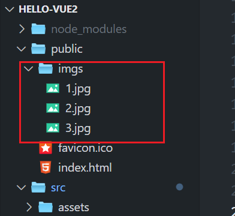

# 案例:

`GoodsDetails.vue`,`GoodsList.vue`

该案例路由配置：
```js
  {
    path: '/example06/GoodsList',
    name: 'example06_GoodsList',
    component: () => import('../examples/example06/GoodsList.vue')

  },
  {
    path: '/example06/GoodsDetails',
    name: 'example06_GoodsDetails',
    component: () => import('../examples/example06/GoodsDetails.vue')

  }
```

图片存放位置:




# 介绍


我会通过一个简单的例子帮助你理解 `query: {}` 语法的作用。


### 背景：

假设你在开发一个电商网站，其中有一个商品列表页面，用户可以点击某个商品来查看该商品的详情。通过 `Vue Router` 路由跳转功能，我们可以在点击商品时将商品的 ID 传递到商品详情页面。这个商品 ID 会作为 URL 的查询参数传递。

### 案例描述：

我们有两个页面：
1. **商品列表页面**：显示多个商品，用户点击每个商品时会跳转到商品详情页。
2. **商品详情页面**：显示该商品的详细信息，基于商品的 ID 来查询并显示。

### 步骤 1：在商品列表页面使用 `<router-link>`

假设我们有一个包含商品列表的页面，每个商品都显示在一个 `router-link` 标签中。点击某个商品时，我们将商品的 ID 作为查询参数（query）传递到详情页面。

#### 商品列表模板（`GoodsList.vue`）：

```vue
<template>
  <div>
    <h1>商品列表</h1>
    <ul>
      <!-- 假设 item 是我们商品数组中的一个商品对象 -->
      <li v-for="item in goods" :key="item.product_id">
        <!-- 使用 router-link 跳转到商品详情页，并传递商品的 product_id 作为查询参数 -->
        <router-link :to="{ path: '/goods/details', query: { productID: item.product_id } }">
          
          <h2>{{ item.product_name }}</h2>
        </router-link>
      </li>
    </ul>
  </div>
</template>

<script>
export default {
  data() {
    return {
      // 商品数据，通常会从服务器获取
      goods: [
        { product_id: 1, product_name: '商品1', product_picture: 'product1.jpg' },
        { product_id: 2, product_name: '商品2', product_picture: 'product2.jpg' },
        { product_id: 3, product_name: '商品3', product_picture: 'product3.jpg' }
      ]
    };
  }
};
</script>
```

在这个例子中：
- `v-for="item in goods"`：循环显示商品列表中的每一项。
- `<router-link :to="{ path: '/goods/details', query: { productID: item.product_id } }">`：这里的 `:to` 是动态绑定的，它构建了一个路由对象，其中：
  - `path: '/goods/details'`：指定跳转的目标路径，即商品详情页。
  - `query: { productID: item.product_id }`：传递查询参数，`productID` 的值是当前商品的 `product_id`。

当用户点击某个商品时，浏览器会跳转到类似 `/goods/details?productID=1`、`/goods/details?productID=2` 这样的 URL，`productID` 就是商品的唯一标识符（商品 ID）。

### 步骤 2：在商品详情页面接收查询参数

在商品详情页面，我们需要读取这个查询参数 `productID`，并根据它来显示相应的商品详细信息。

#### 商品详情页面模板（`GoodsDetails.vue`）：

```vue
<template>
  <div>
    <h1>商品详情</h1>
    <p>商品ID: {{ productID }}</p>
    <!-- 这里可以根据 productID 请求商品的详细信息 -->
  </div>
</template>

<script>
export default {
  data() {
    return {
      productID: null  // 用于存储从 URL 查询参数中获取的商品 ID
    };
  },
  created() {
    // 获取 URL 中的查询参数 productID
    this.productID = this.$route.query.productID;
  }
};
</script>
```

在商品详情页面（`GoodsDetails.vue`）中：
- 我们使用了 `this.$route.query.productID` 来访问 URL 中的查询参数 `productID`。`this.$route` 是 Vue Router 提供的一个对象，包含当前路由的信息，其中 `query` 存储了查询字符串中的所有参数。
- `this.productID = this.$route.query.productID;`：这行代码从 URL 中提取 `productID` 参数，并将其存储到组件的 `productID` 数据属性中。
- 然后我们可以使用 `{{ productID }}` 来在页面上展示商品 ID，或者根据这个 ID 来请求该商品的详细信息。

### URL 示例：
假设用户点击了商品 ID 为 1 的商品，浏览器的地址栏会变成：
```
http://localhost:8080/goods/details?productID=1
```
在商品详情页，`this.$route.query.productID` 会获取到 `1`，你可以用它来请求商品的详细数据。

### 总结：
- `query: { productID: item.product_id }` 是 Vue Router 的路由跳转语法，它表示将 `productID` 作为查询参数传递到 URL 中。`item.product_id` 是商品的唯一标识符。
- 你可以通过 `this.$route.query.productID` 来获取该查询参数，从而实现基于参数加载不同的页面内容（例如显示不同商品的详细信息）。


----------------------


要正确配置 Vue Router 以支持你的页面跳转，首先需要在 `router/index.js` 或类似的路由配置文件中定义路由。在这个例子中，我们有两个页面：

1. **商品列表页面** (`GoodsList.vue`)：显示商品列表，用户点击商品时会跳转到商品详情页。
2. **商品详情页面** (`GoodsDetails.vue`)：显示单个商品的详细信息，基于查询参数（`productID`）来显示对应商品的内容。

### 1. 配置路由文件

首先，你需要在你的 Vue 项目中创建或修改路由配置文件（一般是 `src/router/index.js` 或 `src/router.js`）。在路由配置文件中定义路由路径和组件的对应关系。

#### `router/index.js` 配置示例：

```javascript
import Vue from 'vue'
import Router from 'vue-router'
import GoodsList from '@/views/GoodsList.vue'  // 商品列表页面
import GoodsDetails from '@/views/GoodsDetails.vue'  // 商品详情页面

Vue.use(Router)

export default new Router({
  routes: [
    {
      path: '/',  // 根路径，加载商品列表页面
      name: 'home',
      component: GoodsList
    },
    {
      path: '/goods/details',  // 商品详情页的路径
      name: 'goods-details',
      component: GoodsDetails,
      // 这里没有指定具体的 productID，但我们会通过 query 参数来获取它
      props: (route) => ({ productID: route.query.productID })  // 将查询参数传递给组件
    }
  ]
})
```

### 2. 路由配置解析

- **路径配置**：
  - `path: '/'` 配置了商品列表页面的路由，用户访问根路径 `/` 时会加载 `GoodsList.vue`。
  - `path: '/goods/details'` 配置了商品详情页的路由，用户访问 `/goods/details` 时会加载 `GoodsDetails.vue`。同时，这个路径接收一个查询参数 `productID`，例如 `/goods/details?productID=1`。

- **`props` 选项**：
  - 在 `GoodsDetails` 路由配置中，我们使用了 `props` 选项来将 URL 查询参数传递给组件。具体来说，`props: (route) => ({ productID: route.query.productID })` 表示将 `productID` 查询参数作为一个 prop 传递给 `GoodsDetails` 组件。

### 3. 组件中的 `productID` 获取

在 `GoodsDetails.vue` 中，你可以直接使用 `productID`，因为它已经通过路由的 `props` 传递给了组件。

#### `GoodsDetails.vue` 组件：

```vue
<template>
  <div>
    <h1>商品详情</h1>
    <p>商品ID: {{ productID }}</p>
    <!-- 根据 productID 请求商品的详细信息 -->
  </div>
</template>

<script>
export default {
  props: ['productID'],  // 接收从路由传递过来的 productID 参数
  created() {
    // 你可以在这里根据 productID 请求服务器获取商品详情
    console.log('商品ID:', this.productID);
    // 假设在这里发送请求获取商品的详细数据
  }
};
</script>
```

### 4. 访问路由

- **商品列表页面**：用户访问 `/` 路径时，会加载 `GoodsList.vue` 组件并显示商品列表。
- **商品详情页面**：用户点击商品列表中的某个商品时，`<router-link>` 会将商品的 `productID` 作为查询参数添加到 URL 中，并跳转到 `/goods/details?productID=1`，此时 `GoodsDetails.vue` 会根据 `productID` 显示商品的详细信息。

### 5. 路由跳转的完整流程：

1. 用户访问根路径 `/`，加载商品列表页面（`GoodsList.vue`）。
2. 用户点击某个商品，点击事件触发 `<router-link>`，构建 URL `/goods/details?productID=1`，并跳转到商品详情页面。
3. 路由跳转到 `/goods/details?productID=1`，Vue Router 会匹配到 `GoodsDetails` 路由，且通过 `props` 将查询参数 `productID` 传递给组件。
4. `GoodsDetails.vue` 接收到 `productID` 参数，并在 `created` 钩子中使用该参数获取商品的详细信息。

### 6. 完整示例结构：

假设你的项目结构如下：

```
src/
  └── views/
      ├── GoodsList.vue        // 商品列表页面
      └── GoodsDetails.vue     // 商品详情页面
  └── router/
      └── index.js             // 路由配置文件
```

### 总结：
- **路由配置**：在 `router/index.js` 中配置了商品列表页和商品详情页的路由。
- **查询参数**：通过在 `router-link` 中使用 `query` 来传递查询参数（如 `productID`）。
- **组件接收查询参数**：使用 `props` 选项，将查询参数传递给目标组件（`GoodsDetails.vue`），并在组件中通过 `props` 访问该参数。

这种方式使得 URL 查询参数非常适合在不同页面之间传递一些信息，比如商品的 ID，而不需要改变 URL 路径的结构。


----------------------


在你的商品列表页面中，图片的显示是通过绑定商品对象中的 `product_picture` 字段来完成的。在我的例子中，假设你已经有了一个 `product_picture` 字段，它存储的是图片的 URL 路径。为了让图片显示出来，你需要确保：

1. **图片路径**：你的商品数据中的 `product_picture` 字段应该包含图片的 URL 路径。
2. **正确的 `` 标签**：你应该在商品列表中使用 `` 标签来显示这些图片。

让我们来看一下如何在 `GoodsList.vue` 中显示图片。

### 商品列表页面 `GoodsList.vue` 中显示图片

在商品列表页面，我们将商品的图片显示在 `v-for` 中，通常你会将图片放在 `` 标签的 `src` 属性里。以下是如何修改商品列表页面来显示图片的完整示例：

#### `GoodsList.vue` 完整代码：

```vue
<template>
  <div>
    <h1>商品列表</h1>
    <ul>
      <!-- 假设 item 是我们商品数组中的一个商品对象 -->
      <li v-for="item in goods" :key="item.product_id">
        <!-- 使用 router-link 跳转到商品详情页，并传递商品的 product_id 作为查询参数 -->
        <router-link :to="{ path: '/goods/details', query: { productID: item.product_id } }">
          <!-- 显示商品图片 -->
          
          <h2>{{ item.product_name }}</h2>
        </router-link>
      </li>
    </ul>
  </div>
</template>

<script>
export default {
  data() {
    return {
      // 商品数据，通常会从服务器获取
      goods: [
        { product_id: 1, product_name: '商品1', product_picture: '/images/product1.jpg' },
        { product_id: 2, product_name: '商品2', product_picture: '/images/product2.jpg' },
        { product_id: 3, product_name: '商品3', product_picture: '/images/product3.jpg' }
      ]
    };
  }
};
</script>

<style scoped>
/* 给图片添加样式 */
.product-image {
  width: 100px; /* 设置图片宽度 */
  height: auto; /* 自适应高度 */
  margin-bottom: 10px; /* 给图片下方留一些空间 */
}
</style>
```

### 关键部分说明：

1. **图片路径**：
   - 我在 `goods` 数组中的每个商品对象里，给 `product_picture` 字段指定了一个图片路径（例如：`/images/product1.jpg`）。
   - 这个路径是相对路径，假设你的项目结构是标准的 Vue 项目结构，图片放在 `public/images` 文件夹下。图片的路径会相对于 `public` 文件夹。

2. **`` 标签**：
   - 使用 `:src="item.product_picture"` 将 `product_picture` 字段的值作为 `src` 属性，动态绑定图片路径。每个商品的图片都会显示在商品名称旁边。
   - `alt="Product Image"`：为图片添加一个描述性的 alt 文本，方便屏幕阅读器和图片无法加载时的显示。

3. **CSS 样式**：
   - 在 `style` 部分，我为图片添加了 `.product-image` 样式。可以设置图片的宽度、高度以及其他样式（如 margin 等）。
   - `width: 100px;` 设置图片的宽度为 100px，你可以根据实际需求调整大小。
   - `height: auto;` 确保图片的高度根据宽度自适应，保持图片的纵横比例。

### 图片存放位置：

在 Vue 项目中，图片文件通常存放在以下地方：

1. **`public` 文件夹**：如果你把图片放在 `public/images` 文件夹下，可以通过 `/images/product1.jpg` 的路径来引用。这是最常见的做法，因为文件夹中的内容会直接映射到 URL 中，浏览器能够直接访问。
   
2. **`src/assets` 文件夹**：如果你想通过 Webpack 进行处理和优化（如压缩图片），你可以将图片放在 `src/assets` 文件夹中，然后通过 `import` 来引用。

### 放在 `public/images` 中

假设你将图片放在 `public/images` 目录下，项目结构如下：

```
public/
  └── images/
      ├── product1.jpg
      ├── product2.jpg
      └── product3.jpg

src/
  └── views/
      └── GoodsList.vue
```

此时，`product_picture` 字段中的路径就可以是 `/images/product1.jpg`，这样浏览器会根据路径加载图片。

### 放在 `src/assets` 中

如果你将图片放在 `src/assets` 文件夹下，你需要使用 `require` 或 `import` 来动态加载图片。

例如，假设图片在 `src/assets/images/product1.jpg`，你可以这样改写 `GoodsList.vue`：

#### `GoodsList.vue` 使用 `require`：

```vue
<template>
  <div>
    <h1>商品列表</h1>
    <ul>
      <li v-for="item in goods" :key="item.product_id">
        <router-link :to="{ path: '/goods/details', query: { productID: item.product_id } }">
          <!-- 使用 require 动态加载图片 -->
          
          <h2>{{ item.product_name }}</h2>
        </router-link>
      </li>
    </ul>
  </div>
</template>

<script>
export default {
  data() {
    return {
      goods: [
        { product_id: 1, product_name: '商品1', product_picture: 'product1.jpg' },
        { product_id: 2, product_name: '商品2', product_picture: 'product2.jpg' },
        { product_id: 3, product_name: '商品3', product_picture: 'product3.jpg' }
      ]
    };
  }
};
</script>
```

这样，你就可以通过 Webpack 处理图片，`require` 语句会告诉 Webpack 在打包时处理这些图片资源。

### 总结：

1. 如果你的图片放在 `public/images/` 目录下，直接在 `product_picture` 字段中使用相对路径（例如：`/images/product1.jpg`）。
2. 如果图片在 `src/assets/` 目录下，可以使用 `require` 动态加载图片，确保 Webpack 能处理这些图片。
3. 使用 `` 动态绑定图片路径，确保商品图片正确显示。


